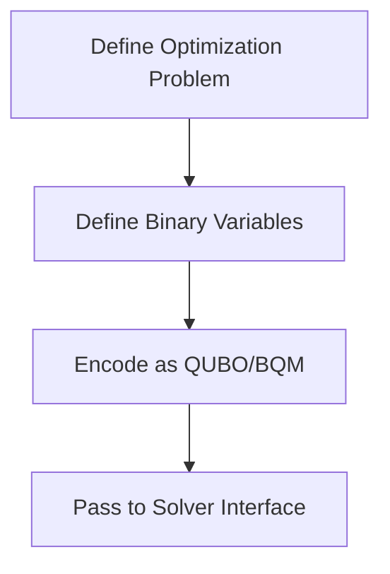
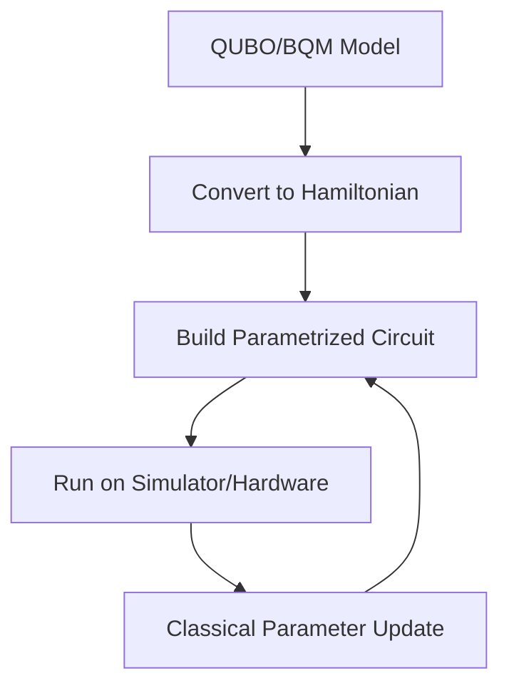
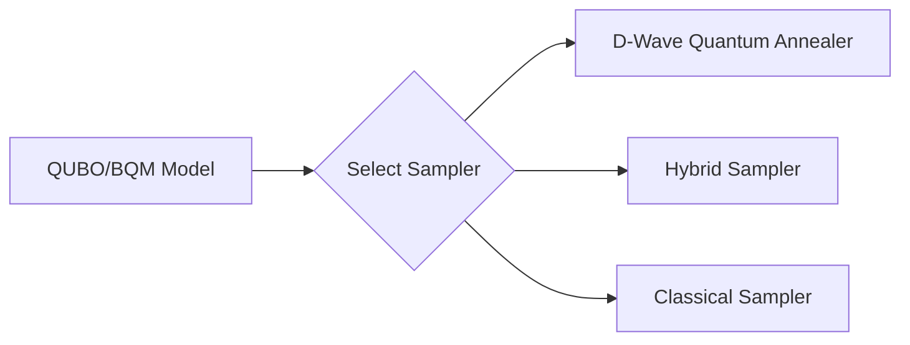

# 03 – Tools and Libraries

*Concrete software stacks and APIs for implementing quantum optimization algorithms*

This document groups tools by **function in the optimization workflow**; from problem modeling to solver execution and benchmarking. Each entry includes purpose, typical uses, and links to official resources.

---

## 1. Problem Modeling & QUBO/Ising Construction

These libraries help convert optimization problems into **QUBO** or **Binary Quadratic Models (BQM)** — the canonical format accepted by most solvers.

| Tool               | Role                                                         | Documentation                                                                                                          |
| ------------------ | ------------------------------------------------------------ | ---------------------------------------------------------------------------------------------------------------------- |
| **PyQUBO**         | Python API for building QUBO from objectives and constraints | [https://github.com/recruit-communications/pyqubo](https://github.com/recruit-communications/pyqubo)                   |
| **dimod**          | Binary Quadratic Model interface (common format)             | [https://docs.ocean.dwavesys.com/en/stable/docs_dimod/](https://docs.ocean.dwavesys.com/en/stable/docs_dimod/)         |
| **dwavebinarycsp** | Constraint satisfaction → BQM converter                      | [https://docs.ocean.dwavesys.com/en/stable/docs_binarycsp/](https://docs.ocean.dwavesys.com/en/stable/docs_binarycsp/) |

### Modeling Pipeline — Example



---

## 2. Gate-Model Quantum Frameworks

Gate-model tools support **QAOA** and other variational methods. They help you build circuits, manage parameters, and connect to simulators or real hardware.

| Framework     | Use Cases                                    | Link                                                                         |
| ------------- | -------------------------------------------- | ---------------------------------------------------------------------------- |
| **Qiskit**    | Circuit builder + optimization modules       | [https://qiskit.org/](https://qiskit.org/)                                   |
| **Cirq**      | Low-level circuit API, suitable for research | [https://quantumai.google/cirq](https://quantumai.google/cirq)               |
| **PennyLane** | Hybrid quantum-classical workflows           | [https://pennylane.ai/](https://pennylane.ai/)                               |
| **OpenQAOA**  | SDK for QAOA workflows                       | [https://github.com/OpenQAOA/openqaoa](https://github.com/OpenQAOA/openqaoa) |

#### Gate-Model Optimization Workflow



---

## 3. Annealing & Hybrid Optimization Stacks

These stacks provide APIs for **quantum annealers (e.g., D-Wave)** and hybrid classical/quantum workflows optimized for QUBO/BQM problems.

| Stack                       | Description                             | Link                                                                                                         |
| --------------------------- | --------------------------------------- | ------------------------------------------------------------------------------------------------------------ |
| **D-Wave Ocean SDK**        | Full toolchain for D-Wave annealers     | [https://docs.ocean.dwavesys.com/](https://docs.ocean.dwavesys.com/)                                         |
| **dwave_neal**              | Simulated annealer (classical baseline) | [https://docs.ocean.dwavesys.com/en/stable/docs_neal/](https://docs.ocean.dwavesys.com/en/stable/docs_neal/) |
| **Hybrid Samplers (Ocean)** | Combines classical and quantum sampling | [https://docs.ocean.dwavesys.com/en/stable/hybrid/](https://docs.ocean.dwavesys.com/en/stable/hybrid/)       |

### Annealing + Hybrid Pipeline



---

## 4. Simulation and Auxiliary Tools

These tools accelerate simulation, enable parameter sweeps, or support hybrid workflows with classical ML frameworks.

| Tool                   | Purpose                                    | Link                                                                             |
| ---------------------- | ------------------------------------------ | -------------------------------------------------------------------------------- |
| **QuTiP**              | General quantum simulation of Hamiltonians | [https://qutip.org/](https://qutip.org/)                                         |
| **TensorFlow Quantum** | Hybrid circuit + ML workflows              | [https://www.tensorflow.org/quantum](https://www.tensorflow.org/quantum)         |
| **cuQuantum**          | GPU-accelerated quantum simulation         | [https://developer.nvidia.com/cuquantum](https://developer.nvidia.com/cuquantum) |

---

## 5. Cloud and Multi-Provider Execution

These services allow running on multiple backends (gate and annealing) under one API.

| Platform                    | Features                                                | Link                                                                                           |
| --------------------------- | ------------------------------------------------------- | ---------------------------------------------------------------------------------------------- |
| **Amazon Braket**           | Unified access to multiple quantum backends             | [https://aws.amazon.com/braket/](https://aws.amazon.com/braket/)                               |
| **Microsoft Azure Quantum** | Integrated provider ecosystem + optimization primitives | [https://azure.microsoft.com/services/quantum/](https://azure.microsoft.com/services/quantum/) |

These platforms help compare solver behavior across hardware types.

---

## Quick Comparison — Tools by Role

| Category                  | Examples                               |
| ------------------------- | -------------------------------------- |
| **Modeling**              | PyQUBO, dimod, dwavebinarycsp          |
| **Gate-Model Frameworks** | Qiskit, Cirq, PennyLane, OpenQAOA      |
| **Annealing & Hybrids**   | Ocean SDK, dwave_neal, hybrid samplers |
| **Simulation**            | QuTiP, TensorFlow Quantum, cuQuantum   |
| **Cloud Execution**       | Amazon Braket, Azure Quantum           |

---

## Key Links (Implementation-Focused)

### Problem Modeling

* **PyQUBO** — [https://github.com/recruit-communications/pyqubo](https://github.com/recruit-communications/pyqubo)
* **Dimod** — [https://docs.ocean.dwavesys.com/en/stable/docs_dimod/](https://docs.ocean.dwavesys.com/en/stable/docs_dimod/)

### Gate Model

* **Qiskit Optimization** — [https://github.com/qiskit-community/qiskit-optimization](https://github.com/qiskit-community/qiskit-optimization)
* **Cirq** — [https://quantumai.google/cirq](https://quantumai.google/cirq)
* **PennyLane** — [https://pennylane.ai/](https://pennylane.ai/)
* **OpenQAOA** — [https://github.com/OpenQAOA/openqaoa](https://github.com/OpenQAOA/openqaoa)

### Annealing / Hybrid

* **Ocean SDK** — [https://docs.ocean.dwavesys.com/](https://docs.ocean.dwavesys.com/)
* **dwave_neal** — [https://docs.ocean.dwavesys.com/en/stable/docs_neal/](https://docs.ocean.dwavesys.com/en/stable/docs_neal/)

### Simulation

* **QuTiP** — [https://qutip.org/](https://qutip.org/)
* **TFQ** — [https://www.tensorflow.org/quantum](https://www.tensorflow.org/quantum)

### Cloud Platforms

* **Amazon Braket** — [https://aws.amazon.com/braket/](https://aws.amazon.com/braket/)
* **Azure Quantum** — [https://azure.microsoft.com/services/quantum/](https://azure.microsoft.com/services/quantum/)

---

## Notes on Diagram Syntax

Use the `flowchart` diagram type in Mermaid. GitHub’s Markdown renderer supports this syntax when enclosed in a fenced code block with `mermaid` at the top (e.g., ```mermaid`). Avoid using raw spaces or lowercase reserved words like `end` inside node IDs to prevent parser errors. ([GitHub Docs][1])

---

If you want, I can also include:

* **minimal example code** (Python/SDK snippets) for each stack
* **decision tree diagrams** to pick tools based on problem type and size
* **sample execution pipelines** for real-world use cases (e.g., TFISP + hybrid solvers)

Just tell me what you want next!

[1]: https://docs.github.com/en/enterprise-server%403.16/get-started/writing-on-github/working-with-advanced-formatting/creating-diagrams?utm_source=chatgpt.com "Creating diagrams - GitHub Enterprise Server 3.16 Docs"
