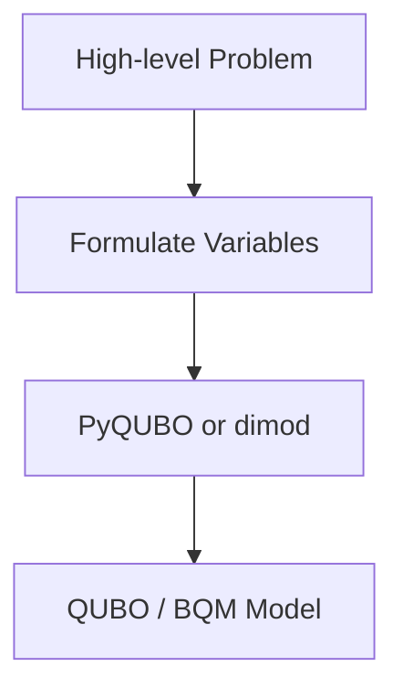
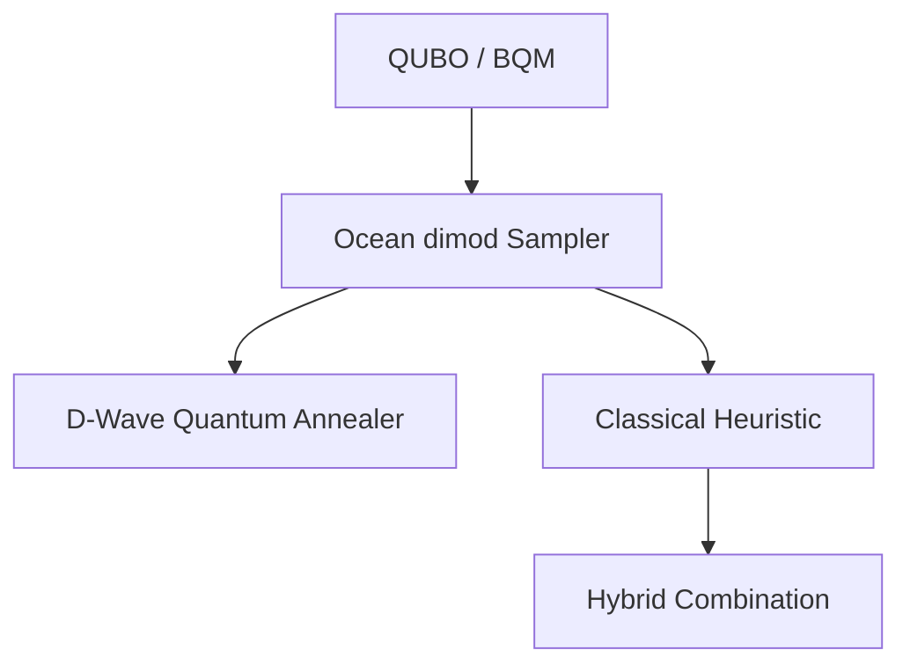

# 03 – Tools and Libraries

*Concrete software stacks and APIs for implementing quantum optimization algorithms*

This document groups tools by **purpose in the optimization workflow** — from problem modeling and QUBO formulation to solver runtime execution and benchmarking. Each section includes **recommended libraries**, **typical usage scenarios**, and **links** for deeper exploration.

---

## 1. Problem Modelling & QUBO/Ising Construction

These libraries help convert high-level optimization problems into **Quadratic Unconstrained Binary Optimization (QUBO)** or **Ising** models, the standard inputs for most quantum optimization runtimes.

| Tool                       | Role                                      | Notes                                                                                                                |
| -------------------------- | ----------------------------------------- | -------------------------------------------------------------------------------------------------------------------- |
| **PyQUBO**                 | QUBO builder                              | Python APIs for constructing QUBO/Ising from objectives and constraints. ([arXiv][1])                                |
| **dwavebinarycsp / dimod** | Binary CSP → BQM conversion               | Part of the D-Wave Ocean SDK; maps constraints and variable combinations into binary quadratic models. ([GitHub][2]) |
| **Qlasskit**               | Python-to-quantum compiler (experimental) | Allows exporting logic functions to QUBO/BQM for annealers and simulators. ([Reddit][3])                             |

**Typical workflows using these tools:**



These are generally the first step in any optimization pipeline.

---

## 2. Gate-Model Quantum Frameworks

Gate-model frameworks provide qubit and circuit abstractions, simulators, and backend connectivity for variational quantum algorithms like QAOA.

| Framework     | Primary Uses                                                     | Backends                                                              |
| ------------- | ---------------------------------------------------------------- | --------------------------------------------------------------------- |
| **Qiskit**    | Circuit building & optimization ecosystem                        | IBM Quantum simulators & hardware ([GitHub][4])                       |
| **Cirq**      | Low-level circuit control, integrable with hybrid stacks         | Google-aligned simulators and various cloud backends ([Wikipedia][5]) |
| **PennyLane** | Hybrid quantum-classical circuits with automatic differentiation | Plug-in support for multiple hardware providers ([Cnblogs][6])        |
| **OpenQAOA**  | SDK focused on QAOA workflows                                    | Simplifies multi-backend, parametrized QAOA execution ([arXiv][7])    |

**Example QAOA workflow (gate-based):**

```mermaid
flowchart TD
    P[Define QUBO/Ising] --> Q[Map to Hamiltonian]
    Q --> R[Construct Parameterized Circuit (QAOA)]
    R --> S[Run on Simulator/Hardware]
    S --> T[Classical Parameter Update]
    T --> R
```

* **Qiskit Optimization**: includes utilities for automatic representation conversion (e.g., from linear/quadratic objectives to exact circuits). ([GitHub][4])
* **OpenQAOA**: standardizes building/executing QAOA experiments across backends with automation. ([arXiv][7])
* **PennyLane**: designed for hybrid quantum circuit workflows with differentiable parameters, useful for integration with classical ML optimizers. ([Cnblogs][6])

---

## 3. Annealing & Hybrid Optimization Stacks

These are currently the **most practical tools** for combinatorial optimization — because they native-solve QUBO/BQM models or combine quantum sampling with classical heuristic refinement.

| Stack                      | Main Capabilities                             | Typical Usage                                                          |
| -------------------------- | --------------------------------------------- | ---------------------------------------------------------------------- |
| **D-Wave Ocean SDK**       | Quantum annealing and hybrid solver APIs      | Conversion of QUBO/CSP to Ising, sampler interfaces ([GitHub][2])      |
| **dwave_neal**             | Simulated annealing sampler                   | Useful performance baseline for quantum annealers ([GitHub][2])        |
| **Hybrid Solvers (Ocean)** | Combination of classical and quantum sampling | Scalability and quality improvements over pure annealing ([GitHub][2]) |

Typical integration for optimization:



Tools:

* **dimod**: a shared data model enabling interchangeable solvers. ([GitHub][2])
* **dwave_system**: simplifies cloud access to D-Wave Advantage or Leap backends. ([GitHub][2])
* **dwavebinarycsp**: constraint modeler for complex combinatorial inputs. ([GitHub][2])

---

## 4. Simulation, Testing & Auxiliary Tools

| Tool                                                      | Purpose                                                                                                                                                                                          |
| --------------------------------------------------------- | ------------------------------------------------------------------------------------------------------------------------------------------------------------------------------------------------ |
| **QuTiP**                                                 | Open-source Python library for simulating quantum systems (general dynamics, Hamiltonians). Useful when modeling physical systems or optimizing parameterized quantum circuits. ([Wikipedia][8]) |
| **TensorFlow Quantum (TFQ)**                              | Integrates Cirq with TensorFlow for hybrid circuit/ML workflows, enabling gradient-based optimization for parameterized circuits. ([Quantum IQ Lab][9])                                          |
| **High-performance simulators** (e.g., Qulacs, cuQuantum) | Fast classical simulation backends (especially GPU-accelerated), useful for large QAOA parameter sweeps or local solver benchmarking.                                                            |

**Simulation vs actual execution diagram:**

```
Quantum Algorithm
   ├── Simulator (fast performance)
   │      ├── Local CPU simulator
   │      ├── GPU-accelerated (e.g., cuQuantum)
   │      └── High-performance cloud simulators
   └── Real Backend
          ├── Gate-based QPU
          └── Annealing QPU
```

Simulators are essential for iterative development, profiling, and benchmarking prior to execution on real QPUs.

---

## 5. Cloud and Multi-Provider Orchestration

These platforms help abstract over hardware differences and provide unified access:

| Platform          | Features                                                                                                         |
| ----------------- | ---------------------------------------------------------------------------------------------------------------- |
| **Amazon Braket** | Unified access to multiple quantum backends (gate + annealing), combined with classical resources. ([Zhidx][10]) |
| **Azure Quantum** | Integrates multiple provider backends and provides optimization primitives. ([Zhidx][10])                        |

Use orchestration when:

* targeting different solver capabilities,
* running large experiment batches,
* or comparing performance across hardware types.

---

## Quick Comparison Table

| Category                   | Example Tools                     | Best For                         |
| -------------------------- | --------------------------------- | -------------------------------- |
| Modeling/QUBO Construction | PyQUBO, dimod, dwavebinarycsp     | Preparing optimization problems  |
| Gate-Model Circuits        | Qiskit, Cirq, PennyLane, OpenQAOA | QAOA and hybrid circuit design   |
| Annealing & Hybrids        | D-Wave Ocean, dwave_neal          | Large combinatorial optimization |
| Simulation                 | QuTiP, Qulacs, cuQuantum          | Rapid prototyping, validation    |
| Cloud Orchestration        | Amazon Braket, Azure Quantum      | Multi-backend execution          |

---

## Resource Links (Implementation-Focused)

### Problem and Modeling

* PyQUBO — [https://github.com/recruit-communications/pyqubo](https://github.com/recruit-communications/pyqubo) ([arXiv][1])
* dimod & dwavebinarycsp (Ocean) — [https://docs.ocean.dwavesys.com/en/stable/](https://docs.ocean.dwavesys.com/en/stable/) ([GitHub][2])

### Gate Models & Circuit Tools

* Qiskit Optimization — [https://github.com/qiskit-community/qiskit-optimization](https://github.com/qiskit-community/qiskit-optimization) ([GitHub][4])
* Cirq — [https://quantumai.google/cirq](https://quantumai.google/cirq) ([Wikipedia][5])
* PennyLane — [https://pennylane.ai/](https://pennylane.ai/) ([Cnblogs][6])
* OpenQAOA — multi-backend QAOA toolkit ([arXiv][7])
* IQM QAOA Library — (Python toolkit tailored for combinatorial optimization) ([Quantum Computing Report][11])

### Simulation, Benchmarks & Integrations

* QuTiP — [https://qutip.org/](https://qutip.org/) ([Wikipedia][8])
* TensorFlow Quantum — [https://www.tensorflow.org/quantum](https://www.tensorflow.org/quantum) ([Quantum IQ Lab][9])

### Cloud Execution

* Amazon Braket — [https://aws.amazon.com/braket/](https://aws.amazon.com/braket/) ([Zhidx][10])
* Microsoft Azure Quantum — [https://azure.microsoft.com/services/quantum/](https://azure.microsoft.com/services/quantum/) ([Zhidx][10])

---

## Summary

This section maps **optimization workflows** to concrete software components:

* **Problem → Modeling**: PyQUBO, dimod
* **Optimization Routine (Gate)**: Qiskit, PennyLane, Cirq, OpenQAOA
* **Optimization Routine (Annealing/Hybrid)**: Ocean, dwave_neal, hybrid pipelines
* **Simulation & Testing**: QuTiP, TFQ, high-performance simulators
* **Multi-Provider Execution**: Braket, Azure Quantum
